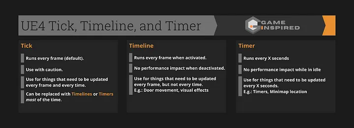

# Tick-Talk
My explanation to how Tick works in Unreal Engine. 


## _**What is a Game Loop?**_

A game loop essentially represents the "time" within a game. At its core, a game consists of a loop that waits for player input (reminiscent of old text-based games). Upon receiving input, it processes the result and then waits for the next input.

In real-time games (such as those developed in Unreal Engine), this loop runs continuously for the duration of the game. While it does wait for player input, it also constantly updates the game state and graphics. This means that player input does not block the program (e.g., an enemy can still attack the player even if they are AFK).

```cpp
while (true)
{
  processInput();
  update();
  render();
}
```

_This loop runs even when the player does not provide input._

The loop runs as quickly as the CPU allows. It also has the responsibility of maintaining a consistent loop time, a topic we'll delve into further in the section on _delta time_.

Since each iteration of the game loop includes rendering the graphics (i.e., a single frame), we can measure the game's speed using the well-known parameter FPS (Frames Per Second). The higher the FPS, the faster the game runs.

Even if you believe your game doesn't require a game loop pattern, consider that any visual or sound effects (VFX or SFX) you want to play while waiting for player input necessitate a game loop that runs without being blocked by player input ✨.

Sources for this chapter: 
[https://gameprogrammingpatterns.com/game-loop.html#a-world-out-of-time](https://gameprogrammingpatterns.com/game-loop.html#a-world-out-of-time)

## _**What is a Tick?**_

A tick refers to a single iteration within the game loop. In the engine, this is commonly known as Event Tick. This event is called once per frame and is influenced by the game's performance and FPS.

We'll discuss when to use a tick and when it's better to use a timer later on. Generally, it's advisable to avoid relying on _Event Tick_ and instead use an alternative method (refer to the chapter "When to use tick and when to use a timer?").

Sources for this chapter: [https://www.youtube.com/watch?v=GyJVYB3IzGAhttps://docs.unrealengine.com/4.27/en-US/ProgrammingAndScripting/ProgrammingWithCPP/UnrealArchitecture/Actors/Ticking/](https://www.youtube.com/watch?v=GyJVYB3IzGAhttps://docs.unrealengine.com/4.27/en-US/ProgrammingAndScripting/ProgrammingWithCPP/UnrealArchitecture/Actors/Ticking/)
## _**What is Delta Time?**_

**Delta time** is the time elapsed between the current frame and the previous frame.

### How Delta Time is Calculated

Delta time is determined by:

1. Recording the real time at the start of the iteration from the OS (or engine).
2. Subtracting this from the real time at the end of the iteration.

This means the longer the frame takes to render, the higher the delta time.

The result is typically in seconds, although it's often in the milliseconds range. You can calculate the delta time for a specific FPS using the formula $1/\text{FPS} = \text{DeltaTime}$.

For example:
- $1/120 = 0.0083333$
- $1/60 = 0.0166666$ (16 milliseconds)
- $1/30 = 0.0333333$
- $1/8 = 0.125$ (the minimum you can set with t.maxFPS)

### The Frame Delay

We use the difference from the previous frame while the current frame is still being calculated. This results in a 1-frame delay for delta time, but over time, it evens out.

### When to Multiply by Delta Time

You should multiply by delta time only for actions that occur over time (and for physics impulses). This ensures that time-dependent processes run consistently regardless of the frame rate.

### Example: Using Delta Time in a Game Loop

Here's an example of how to use the delta time concept to prevent a game loop from running too fast on a powerful machine:

```cpp
while (true) {
  double start = getCurrentTime();
  processInput();
  update();
  render();

  sleep(start + MS_PER_FRAME - getCurrentTime());
}
```

_We essentially wait if we finish too early._ 

### _**Why Do We Need Delta Time?**_

Tick does _not_ reflect real time and can vary across different machines, potentially stalling when loading something heavy. This inconsistency can make the game look choppy or overly fast to developers and players.

To ensure consistency, if we have a time-dependent action (e.g., moving an actor from point A to B in a certain time), we multiply it by delta time to make it **independent** of FPS. Without this, the action would depend on tick rate, leading to varying results depending on FPS. (see example 4:30ish [https://www.youtube.com/watch?v=GyJVYB3IzGA](https://www.youtube.com/watch?v=GyJVYB3IzGA)).

Sources for this chapter: [https://www.youtube.com/watch?v=yGhfUcPjXuEhttps://www.youtube.com/watch?v=GyJVYB3IzGAhttps://forums.unrealengine.com/t/when-using-addforce-do-i-need-to-scale-the-force-by-the-delta-seconds-value/353657/](https://www.youtube.com/watch?v=yGhfUcPjXuEhttps://www.youtube.com/watch?v=GyJVYB3IzGAhttps://forums.unrealengine.com/t/when-using-addforce-do-i-need-to-scale-the-force-by-the-delta-seconds-value/353657/)

## _**What is tick groups?**_

By now, we understand what a tick is (hopefully), and it's time to acknowledge that not all ticks are created equal😔.

In Unreal Engine, we have "tick groups" that determine **when** within the update/iteration of the game loop the tick event should be called to update our classes.

Generally, these groups are separated based on physics: before, during, and after, with an additional tick at the very end of the frame.

By default, actors are set to TG_PrePhysics. UMG auto-manages its tick by default.

|Tick Group|Engine Activity|
|---|---|
|TG_PrePhysics|Beginning of the frame.|
|TG_DuringPhysics|Physics simulation has begun by the time this step is reached. Simulation may finish and update the engine's physics data at any time while ticking this group, or after all group members have ticked.|
|TG_PostPhysics|Physics simulation is complete and the engine is using the current frame's data by the time this step begins.|
|n/a|Process latent actions, tick the world timer manager, update cameras, update level streaming volumes and streaming operations.|
|TG_PostUpdateWork|Called at the latest possible moment inside the tick|
|n/a|Handle deferred spawning of actors created earlier in the frame. Finish the frame and render.|
|note that n/a is 2 other tick groups epic games planned to add but gave up on it. It's still in the docs but those are irrelevant to us right now.||

| Tick Group        | When to use it                                                                                                                                                                                                                                                                                                                                            |
| ----------------- | --------------------------------------------------------------------------------------------------------------------------------------------------------------------------------------------------------------------------------------------------------------------------------------------------------------------------------------------------------- |
| TG_PrePhysics     | Set your class to use this tick group if it needs to interact with physics. This ensures the actor's movement is factored into the physics simulation. Note that when using this tick group, the simulation data you interact with is 1 frame old (since this is the start of the iteration/update).<br>                                                  |
| TG_DuringPhysics  | This tick group is where the physics simulation is run. The simulation can end at any point during this tick, and it is generally recommended to use this tick group only for things that can tolerate being 1 frame off, such as HUD, mini map, or updating inventory displays.                                                                          |
| TG_PostPhysics    | Set your class to this tick group for actions that should happen after everything has finished moving and is in the correct position for the rendered frame. For example, use this for movement traces (e.g., cannons) where a 1-frame lag would be very noticeable.                                                                                      |
| TG_PostUpdateWork | This tick group is called after TG_PostPhysics and after cameras have been updated. It is commonly used for particle systems, where we want to run the logic after everything else has been set. This can also be used to ensure everything is frame-matching, such as in a fighting game where two characters need to grab each other on the same frame. |

[https://www.youtube.com/watch?v=xwR402KlYT0](https://www.youtube.com/watch?v=xwR402KlYT0)

[https://www.youtube.com/watch?v=xwR402KlYT0](https://www.youtube.com/watch?v=xwR402KlYT0)

## _**Tick Dependency**_

If you need an actor or component to tick only after another specific actor or component has ticked (for instance, if data needs to be passed from one component to an actor before the actor runs), you can use a tick dependency instead of relying on tick groups.

You can achieve this using the methods `AddTickPrerequisiteActor` and `AddTickPrerequisiteComponent`.

see BP example here [https://www.youtube.com/watch?v=JbfiolyLpIQ](https://www.youtube.com/watch?v=JbfiolyLpIQ)

To set up a tick dependency, simply input a reference to the actor or component that you want to depend on before ticking. While you can also remove this dependency, it is generally used for very specific cases, so you may not encounter it often.

Sources for this chapter: [https://dev.epicgames.com/documentation/en-us/unreal-engine/actor-ticking-in-unreal-engine?application_version=5.4#tickgrouporderhttps://www.youtube.com/watch?v=JbfiolyLpIQhttps://www.youtube.com/watch?v=xwR402KlYT0](https://dev.epicgames.com/documentation/en-us/unreal-engine/actor-ticking-in-unreal-engine?application_version=5.4#tickgrouporderhttps://www.youtube.com/watch?v=JbfiolyLpIQhttps://www.youtube.com/watch?v=xwR402KlYT0)
## ***Max Physics Delta Time***

To ensure accurate physics calculations separate from the rest of the game, we can set the "physics" tick in Unreal Engine to a different maximum value than the rest of the game. This helps maintain accurate results without affecting render time, even if the game runs at a higher frame rate than expected (e.g., planning for 60FPS but running at 120FPS).


_You can get to this by Project Settings > Engine > Physics._

By setting the Max Physics Delta Time, we define the maximum FPS value for our physics simulation. This is expressed in milliseconds; for example, 0.016 seconds corresponds to 60FPS (you can find the delta time by dividing 1 by the FPS value, e.g., 1/60).

If the game runs at a higher FPS than our set limit, we **clamp the physics simulation time down to 60FPS**. This prevents scenarios where the game physics would run excessively fast on more powerful machines (not that it has ever happened to me😭, of course.. 😭).

## _**What is substep/timestep?**_

Substepping, or timestepping, involves calling smaller (sub) ticks within our physics tick to achieve smoother physics results when the game drops below the expected FPS target. For example, if you set your physics simulations to run optimally at 50-60FPS but want them to work correctly even at 30FPS, you can use substepping.

### Enabling and Configuring Substepping

To enable substepping, go to the project settings. 

 

_You can get to this by Project Settings > Engine > Physics._

Since it looks confusing at first, here’s what the settings mean:

| Setting                | What it does                                                                                                                                                                                                                                                                                                                                                               |
| ---------------------- | -------------------------------------------------------------------------------------------------------------------------------------------------------------------------------------------------------------------------------------------------------------------------------------------------------------------------------------------------------------------------- |
| Substepping Async      | Whether to substep the async phsyics simulation.<br>Unsure exactly why this is needed ATM. Taken from UE docs                                                                                                                                                                                                                                                              |
| Max Substep Delta Time | This value is set in milliseconds and it means that we won't go beyond this value when we do the timestepping. This is like the Max Physics Delta Time, we set this as an upper bound to which we plan our game to support. For example if we set it to 0.016 it means we won't get above 60FPS in our physics simulation when we enable substepping.                      |
| Max Substeps           | This value sets how many substeps we can do. Meaning, when we go below 60FPS and we're in the range of 30-60FPS, UE will put 2 substeps with the duration deltatime/2 to ensure we keep up with the expected physics FPS. If we go below 30FPS UE will put 3 substeps with the duration deltatime/3 and so on. So the higher the number, the lower the FPS we can support. |

If we substep too many times and exceed the desired delta time, we will wait until we reach the desired delta time again.


_Here you can see at the bottom the timesteps waiting for the max delta time as they passed it ([aclockworkberry.com](http://aclockworkberry.com/))_

### Considerations for Substepping

Substepping adds more computational load to the CPU. If the CPU is slow, it can result in computational overhead, leading to a situation where the game continually lags and never catches up. Pay particular attention to the values used, especially the max substeps, as this sets the limit for computational overhead.

Sources for this chapter: [https://www.aclockworkberry.com/unreal-engine-substepping/https://avilapa.github.io/post/framerate-independent-physics-in-ue4/](https://www.aclockworkberry.com/unreal-engine-substepping/https://avilapa.github.io/post/framerate-independent-physics-in-ue4/)

## _**How to work with physics and tick? (AKA slightly less FPS dependent physics)**_

So, we’ve mastered the art of using substeps! 🎉 But wait—when we add our physics simulation, everything still seems the same. What’s going on?

Well, here’s the scoop: Event Tick is only called based on the frame rate rendering tick, and its delta time is tied to that frame rendering tick. So where did our precious substeps disappear to?

The magic happens with the BodyInstance of the object you're working on. All the reading and writing of physics data is handled by the BodyInstance, which stays up to date with physics steps. Meanwhile, the actual root component is only updated once per Tick().

Example on how to use BodyInstance:

```
// Getting the transformation matrix of the object
FTransform WorldTransform = box_component_->GetBodyInstance()->GetUnrealWorldTransform_AssumesLocked();

// World Location
FVector Location = WorldTransform.GetLocation();

// Getting the forward, right, and up vectors
FVector Forward = WorldTransform.GetUnitAxis(EAxis::X);
FVector Right   = WorldTransform.GetUnitAxis(EAxis::Z);
FVector Up      = WorldTransform.GetUnitAxis(EAxis::Y);

```

Now applying forces also requires us to specify we use substepping

```
// Adding forces
box_component_->GetBodyInstance()->AddForce(Forward, false);
box_component_->GetBodyInstance()->AddTorque(Right, false, true);
box_component_->GetBodyInstance()->AddForceAtPosition(-Forward, StartPoint, false);

```

> Note that there is an extra parameter in each of the functions called bAllowSubstepping. 

> Note: As you might know, you don’t need to multiply physics forces by the Delta Time*, as UE does that for you. 
> Although, `AddTorque` is a bit weird with how it's calculated but correct sub-stepping configuration should yield good enough results for most stuff you're working on.

> [!Note about requirements]
> *We need to have a rigidbody as our root i.e. any Component extending UPrimitiveComponent so we could use a body instance.*

Update for UE5.1 and above: You can't access substepping any more as a client and it can only be exposed through FGearVehicle or another async physics plugin..
[https://itscai.us/blog/post/ue-physics-framework/https://forums.unrealengine.com/t/physics-sub-stepping/3565/30?u=heyoletsgo9](https://itscai.us/blog/post/ue-physics-framework/https://forums.unrealengine.com/t/physics-sub-stepping/3565/30?u=heyoletsgo9)

Sources for this chapter:
[https://avilapa.github.io/post/framerate-independent-physics-in-ue4/https://www.aclockworkberry.com/unreal-engine-substepping/](https://avilapa.github.io/post/framerate-independent-physics-in-ue4/https://www.aclockworkberry.com/unreal-engine-substepping/)

## _**When to use tick and when to use timer?**_

This is a loaded question that you'll see a lot of fighting over in the internet (and IRL if you're fun and feral).

Generally the guideline is:

> "If something always has to be done use tick. Anything else you want to do relatively infrequently is for timer". - Peachmage, a friend of mine who's a AAA senior UE dev.

And now more into detail 'cause quoting a friend is equal to nothing lol.

### So when should you use _Event_ Tick?

Basically never.. You should only use it for stuff that _has_ to be updated every frame as long as the game runs.

For example:

- Custom character movement
- Dynamic camera animations
- Dynamic character audio changes
- Procedural animations
- Feeding actor positions to a post-process material

These are stuff that need to be updated per frame and having them separated of framerate will cause stuttering.

> Event based mentality
> 
> - If your implementation’s start and end can be measured, and it’s not the game’s start and end, then your stuff should be event-based. If your script is contextual within your game world, it is event-based. If the instigator of your action is known, that action is event-based. -Hristo Enchev

> "Movement should be tick based as you want to move every frame otherwise you'll render 2+ frames with the same position, move, then render again for a few frames and it will look like you're stuttering." - Peachmage

### For all tick uses other than the options mentioned above;

You should consider using a Localized Tick that gets triggered by events rather than running continuously. You can set this up using a _**Timeline set to looping.**_

If your Event Tick currently has a branch, consider switching it to a Localized Tick. Instead of toggling a boolean value (as you might with a branch), call an event to start or end your tick, as illustrated in the image below.

Do note though: 
Timelines are **actor components**. You can find them as variables in the component section in Blueprint. Since they're components, they have their own independent tick separate from the owning actor. This means they continue to tick normally even if the actor’s tick is disabled or if there’s a tick interval set on the owning actor. 

This is great if you don't need the actor to tick and only need a localized tick, but not so great if you expect it to inherit the tick setting automatically from your owning actor.

You can configure timelines to tick when paused or set a specific tick interval. Simply drag the timeline component reference variable and adjust its settings just like you would for any other component.


_This saves us overhead execution and gives greater control than a boring Event Tick._


_You can open your Timeline and set it to loop and select a tick group. This gives you much more control on how and when your tick is run compared to Event Tick._ 

### Stuff that has to use tick but doesn't have to be _Event_ Tick are:

- Physics forces that aren't player movement (excluding Impulses)
- Value interpolation (lerp, slerp, interp, ease, etc)

> Though we covered physics in an earlier chapter with substepping, if you don't use substepping, you should consider using a localized tick instead.
### For anything else you should use a Timer.

Timers give you control over the interval at which your function or event is called, making them perfect for things like:

- Weapon shots
- Data recordings
- Ability cooldowns

However, a friendly reminder: _**Timers are dependent on FPS.**_ If you set the `Time` value lower than delta time, the timer will call the event multiple times in a single frame, creating a burst rather than evenly spaced intervals. This is a waste of execution that can be executed once with a higher delta time instead.

 
_Since UE 5.4 there's an option to limit the execution to be `Max Once Per Frame` to avoid bursting execution and wasting CPU._

### When do timers tick?

Timers tick with the TickManager (you call it in C++ to use timers), and TickManager ticks between the tick groups PostPhysics and PostUpdateWork. So take it into account, you shouldn't use physics with timers.

### Regarding UMG,

they automatically handle ticking. You can disable them from ticking in class settings. But! you should still avoid binds as much as you can.

If you want them to _**stop**_ ticking when game is paused, you need to create your own C++ tick/base widget class. ([https://forums.unrealengine.com/t/umg-pause/319032/7](https://forums.unrealengine.com/t/umg-pause/319032/7))

According to Hristo Enchev

> "Using the event tick of the widget and manipulating multiple objects is more performant than running the same code in multiple binds."
> 
> ([https://medium.com/hri-tech/tick-101-implementation-approach-and-optimization-tips-c6be10b3e092](https://medium.com/hri-tech/tick-101-implementation-approach-and-optimization-tips-c6be10b3e092)).

### _**For better performance you should disable tick in everything that shouldn't use tick to save execution time.**_


Sources for this chapter: [https://medium.com/hri-tech/tick-101-implementation-approach-and-optimization-tips-c6be10b3e092https://forums.unrealengine.com/t/tick-vs-timers/118402/5https://forums.unrealengine.com/t/timer-lets-you-set-tick-interval-so-what-is-the-default-tick-interval-of-an-event-tick/48421/9https://www.tomlooman.com/unreal-engine-cpp-timers/https://forums.unrealengine.com/t/keeping-widget-blueprint-ticking-when-paused/260087/4https://forums.unrealengine.com/t/what-is-more-efficient-tick-or-timer/439943](https://medium.com/hri-tech/tick-101-implementation-approach-and-optimization-tips-c6be10b3e092https://forums.unrealengine.com/t/tick-vs-timers/118402/5https://forums.unrealengine.com/t/timer-lets-you-set-tick-interval-so-what-is-the-default-tick-interval-of-an-event-tick/48421/9https://www.tomlooman.com/unreal-engine-cpp-timers/https://forums.unrealengine.com/t/keeping-widget-blueprint-ticking-when-paused/260087/4https://forums.unrealengine.com/t/what-is-more-efficient-tick-or-timer/439943)
## _**Tick interval:**_

You can set how fast an actor/component will tick with tick interval. You can't set it to a value smaller than delta time 'cause then it will just tick with FPS when you set the value too low, unlike timers with `Max Once Per Frame` turned off. When setting a new tick interval during run time your tick interval will only update on the next tick. Setting the tick interval to 0 will make the actor/component tick every frame (default).

(when I say component I mean _actor_ component here)

According to this source, if you try to shorten the tick interval during runtime it's recommended to disable tick, shorten the interval and activate it again to prevent waiting for the next tick? I'm not sure about this info tbh and IMO if you get to this scenario you should probably rethink the way you do things. [https://forums.unrealengine.com/t/changing-actor-tick-interval-while-running/331964/7?u=heyoletsgo9](https://forums.unrealengine.com/t/changing-actor-tick-interval-while-running/331964/7?u=heyoletsgo9)

[https://www.youtube.com/watch?v=Axz20Fj_Kp8https://dev.epicgames.com/documentation/en-us/unreal-engine/API/Runtime/Engine/GameFramework/AActor/SetActorTickInterval](https://www.youtube.com/watch?v=Axz20Fj_Kp8https://dev.epicgames.com/documentation/en-us/unreal-engine/API/Runtime/Engine/GameFramework/AActor/SetActorTickInterval)

Another source for this chapter, but this one has a lot more details, would be worth reading thru all of this. This also covers Task Graphs! (and is outdated about the physics tick 😭) [https://www.casualdistractiongames.com/post/2018/12/10/unreal-tick-functions-delta-time-and-the-task-graph](https://www.casualdistractiongames.com/post/2018/12/10/unreal-tick-functions-delta-time-and-the-task-graph)

### _**Tick interval vs timer:**_

Timers will tick even when the actor's tick is disabled in class defaults. Meaning if your actor shouldn't tick all the time you can just disable tick and use a timer with the interval you wanted instead. [https://www.youtube.com/watch?v=T9Kzq4SvrAA](https://www.youtube.com/watch?v=T9Kzq4SvrAA)

Recommended here that you should use timers instead of tick interval, and if you don't need your actor to tick all the time it's better to just use timers (timers tick even if the actor's tick is disabled). _Take this with a grain of salt as this links to the forum discussion I found this info at, no official sources, though it does make sense..._[https://forums.unrealengine.com/t/tick-interval-and-performance/150254/2](https://forums.unrealengine.com/t/tick-interval-and-performance/150254/2)

### _**Timers over tick:**_

> Timers have several benefits over Tick.
> 
> They can skip condition checks when not needed as one class keeps track of all timers running.
> 
> All timers are listed in a sorted list so they will always be executed in the same order unlike Ticking Actors in the same group.

> Use Tick for ticking every frame with or without interruptions.
> 
> Use Timers for everything else. [https://www.reddit.com/r/unrealengine/comments/gtxy6j/tickinterval_vs_timer/](https://www.reddit.com/r/unrealengine/comments/gtxy6j/tickinterval_vs_timer/) Do note that timers are called after post physics so movement should still be on tick (without interval!).



[https://gameinspired-mail.medium.com/ue4-ticks-timelines-and-timers-9c7333952331](https://gameinspired-mail.medium.com/ue4-ticks-timelines-and-timers-9c7333952331)

Tick (even with interval) has a greater performance cost even when it's not called, unlike timers and timeline that can be deactivated.

### _**Conclusion?**_

Tick interval works like timers but you can set it's tick group. Generally if you want something to loop not on frame (aka custom tick interval), the tick group becomes meaningless as you lose the accuracy you want either way. (I didn't find anything that says tick interval is better than a timer. I did find usage where they mix both options (link below) but tick interval could still be replaced with a second timer instead).

So, my conclusion is that tick interval is a cool option to make things tick less often and save some performance. But if you want to have better control and performance, just turn off ticking in the class defaults and use multiple timers as they give greater control _when_ a class should tick and how often (you can also avoid bursting with timers since UE5.4), (and avoid going any lower than 0.1 - 0.05 as that's the average delta time).

(this is the link below) [https://www.cbgamedev.com/blog/quick-dev-tip-74-ue4-ue5-optimising-tick-rate](https://www.cbgamedev.com/blog/quick-dev-tip-74-ue4-ue5-optimising-tick-rate)

## _**Timelines and timers, extra info**_

Timelines are **actor components**, you can find them as variables in the component section in BP. Since they're components they have independent tick than the owning actor. Meaning they tick normally even when the actor's tick is disabled and when there's a tick interval on the owning actor.

Since timelines are components, you can set them to tick when paused or set a tick interval for them. You can do that by dragging the timeline component reference variable and set it's setting like you would for any other component.

(the source for this section is me experimenting with the engine)

Timers on the other hand will not run when the game is paused. However they are still independent from the owning actor as they are part of `FTimerManager` and owning actor's tick interval will not affect them.

[https://dev.epicgames.com/documentation/en-us/unreal-engine/gameplay-timers-in-unreal-engine](https://dev.epicgames.com/documentation/en-us/unreal-engine/gameplay-timers-in-unreal-engine)

### Some extra notes:

I didn't cover everything about tick here, you can see in the advanced tick settings here there's also `Tick Even when Paused` that UMG can inherit from. You can also set interval for your actor ticks, and plenty of other things you can dive a lot more into.  There's also Mono Tick and options to spread your execution evenly in a tick. I left those as extras with starting links for you to dive more into them if you so wish.
## _**Disclaimer:**_

A lot of the images here were taken from the sources I linked. I'm unsure about my understanding of some of the subjects covered here and some things might require more testing.

If you find any mistakes you can contact me through Discord or Linkedin and (politely please) let me know. Discord: ayenneuman Linkedin: [https://www.linkedin.com/in/emanuel-nm/](https://www.linkedin.com/in/emanuel-nm/)

## _**Extra: What is mono tick?**_

[https://forums.unrealengine.com/t/released-mono-ticking-improving-tick-performance-in-a-few-minutes/151262/4](https://forums.unrealengine.com/t/released-mono-ticking-improving-tick-performance-in-a-few-minutes/151262/4)

## _**Extra: Spreading a loop in a tick?**_

[https://forums.unrealengine.com/t/a-couple-of-useful-macros-loops-per-tick/31890/23](https://forums.unrealengine.com/t/a-couple-of-useful-macros-loops-per-tick/31890/23)


## _**Advanced Tick() Functionality: Tickables & Multi-Tick (Extra)**_

Multi tick and stuff. You can make non component/actors tick and they'll tick after TG_PostUpdate. [https://dev.epicgames.com/community/learning/tutorials/D7P8/unreal-engine-advanced-tick-functionality-tickables-multi-tick](https://dev.epicgames.com/community/learning/tutorials/D7P8/unreal-engine-advanced-tick-functionality-tickables-multi-tick)
## _**Sources:**_

### Gameloop

[https://gameprogrammingpatterns.com/game-loop.html#a-world-out-of-time](https://gameprogrammingpatterns.com/game-loop.html#a-world-out-of-time)

### Tick

[https://www.youtube.com/watch?v=GyJVYB3IzGAhttps://docs.unrealengine.com/4.27/en-US/ProgrammingAndScripting/ProgrammingWithCPP/UnrealArchitecture/Actors/Ticking/](https://www.youtube.com/watch?v=GyJVYB3IzGAhttps://docs.unrealengine.com/4.27/en-US/ProgrammingAndScripting/ProgrammingWithCPP/UnrealArchitecture/Actors/Ticking/)

### Delta time

[https://www.youtube.com/watch?v=yGhfUcPjXuEhttps://www.youtube.com/watch?v=GyJVYB3IzGA](https://www.youtube.com/watch?v=yGhfUcPjXuEhttps://www.youtube.com/watch?v=GyJVYB3IzGA)

### Tick groups

[https://www.youtube.com/watch?v=xwR402KlYT0[https://dev.epicgames.com/documentation/en-us/unreal-engine/actor-ticking-in-unreal-engine?application_version=5.4#tickgrouporderhttps://dev.epicgames.com/documentation/en-us/unreal-engine/actor-ticking-in-unreal-engine?application_version=5.4#tickgrouporder](https://dev.epicgames.com/documentation/en-us/unreal-engine/actor-ticking-in-unreal-engine?application_version=5.4#tickgrouporder)https://www.youtube.com/watch?v=JbfiolyLpIQ](https://www.youtube.com/watch?v=xwR402KlYT0%5Bhttps://dev.epicgames.com/documentation/en-us/unreal-engine/actor-ticking-in-unreal-engine?application_version=5.4#tickgrouporderhttps://dev.epicgames.com/documentation/en-us/unreal-engine/actor-ticking-in-unreal-engine?application_version=5.4#tickgrouporder%5D(https://dev.epicgames.com/documentation/en-us/unreal-engine/actor-ticking-in-unreal-engine?application_version=5.4#tickgrouporder)https://www.youtube.com/watch?v=JbfiolyLpIQ)

### Substepping

[https://www.aclockworkberry.com/unreal-engine-substepping/https://docs.unrealengine.com/4.27/en-US/InteractiveExperiences/Physics/Substepping/](https://www.aclockworkberry.com/unreal-engine-substepping/https://docs.unrealengine.com/4.27/en-US/InteractiveExperiences/Physics/Substepping/)

### Physics and tick

[https://avilapa.github.io/post/framerate-independent-physics-in-ue4/https://www.aclockworkberry.com/unreal-engine-substepping/](https://avilapa.github.io/post/framerate-independent-physics-in-ue4/https://www.aclockworkberry.com/unreal-engine-substepping/)

### When to use tick or timer

[https://medium.com/hri-tech/tick-101-implementation-approach-and-optimization-tips-c6be10b3e092https://forums.unrealengine.com/t/tick-vs-timers/118402/5https://forums.unrealengine.com/t/timer-lets-you-set-tick-interval-so-what-is-the-default-tick-interval-of-an-event-tick/48421/9https://www.tomlooman.com/unreal-engine-cpp-timers/https://forums.unrealengine.com/t/keeping-widget-blueprint-ticking-when-paused/260087/4https://forums.unrealengine.com/t/what-is-more-efficient-tick-or-timer/439943](https://medium.com/hri-tech/tick-101-implementation-approach-and-optimization-tips-c6be10b3e092https://forums.unrealengine.com/t/tick-vs-timers/118402/5https://forums.unrealengine.com/t/timer-lets-you-set-tick-interval-so-what-is-the-default-tick-interval-of-an-event-tick/48421/9https://www.tomlooman.com/unreal-engine-cpp-timers/https://forums.unrealengine.com/t/keeping-widget-blueprint-ticking-when-paused/260087/4https://forums.unrealengine.com/t/what-is-more-efficient-tick-or-timer/439943)


|Type|Affected by Time Dilation|Affected by FPS|Affected By Pause Game|FPS drops?|Notes|
|---|---|---|---|---|---|
|Event Tick|yes|yes|can be set not to||Can use delta time to offset FPS. Can be set to run while paused.|
|Gameplay Timer|yes|yes if interval time is lower than delta time|yes||Can't be set to an interval lower than delta time.|
|Timeline|yes|yes|can be set not to||Can be set to run while paused and set with a custom tick interval.|
|Audio Time|no|no|yes||TBH IDK why it's called audio time.<br>Returns time in seconds since world was brought up for play, IS stopped when game pauses, NOT dilated/clamped.|
|Game Time|yes|no|yes||Returns time in seconds since world was brought up for play.|
|Real Time In Seconds|no|not really. see note in accurate real time below|no||Returns time in seconds since world was brought up for play, does NOT stop when game pauses, NOT dilated/clamped.|
|Accurate Real Time In Seconds|no|no|no||Returns time in seconds since the application was started. Unlike the other time functions this is accurate to the exact time this function is called instead of set once per frame.|
|Unpaused Time|yes|no|no||Returns time in seconds since world was brought up for play, adjusted by time dilation and IS NOT stopped when game pauses.|
|Music Playback Percent||||||
|Now|no|no|no||Was called Current OS Time previously?<br>Returns the time from the computer as integer struct.|
